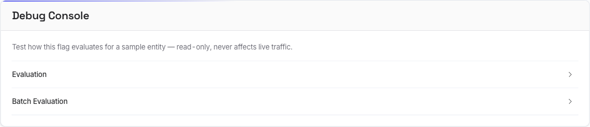

# Flagr Debug Console

One can debug the Flagr evaluation using the debug console.
Debug console is a frontend component that wraps the evaluation API.
It's attached inside each flag page, and it helps to test and try the flag settings
with entities.

