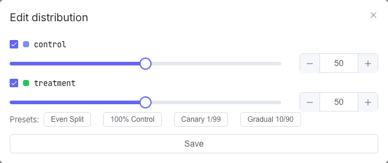

# Distributions

A **distribution** splits the traffic *inside* a segment across variants — 50/50, 90/10, 100% to one variant, and so on. Once an entity is included by the segment's [rollout](flagr_ui_segments), the distribution decides which variant it actually gets.

Each segment has its own distribution, shown on the flag's **Config** tab.

## The distribution bar

When a segment has a distribution, a colored bar shows the split: each variant gets a slice sized by its percentage, with a legend of variant keys and percentages. A segment with no distribution shows **No distribution set** instead — fix it with **edit**. If a saved distribution somehow doesn't total 100%, the bar shows a **⚠ warning** with the actual sum.

## Edit a distribution

Click **edit** on the segment's Distribution to open the editor:

1. **Check the variants** you want to include. A checked variant starts at 0% and can be given a share.
2. Set each one's share with the **slider** or the number box.
3. The percentages **must add up to 100%** — until they do, an alert shows the current sum and **Save** stays disabled.
4. **Save** to apply. Variants left at **0% are dropped** from the saved distribution — to keep a variant in the split, give it a non-zero share.

## Presets

The editor offers one-click starting points:

| Preset | What it sets |
|--------|--------------|
| **Even Split** | Splits 100% evenly across the selected variants (e.g. 33/33/34). |
| **100% Control** | Puts 100% on the first variant, 0% on the rest. |
| **Canary 1/99** | 1% to the first variant, 99% to the second — a tiny canary slice. |
| **Gradual 10/90** | 10% to the first, 90% to the second — a small staged rollout. |

Canary and Gradual need at least two selected variants. If no variants are checked when you apply a preset, Flagr selects them all for you first. After applying a preset you can still fine-tune the sliders.

## Rollout vs. distribution

These are two different steps, and a common source of confusion:

- **Rollout %** (on the [segment](flagr_ui_segments)) answers *"is this entity in the segment at all?"* — it gates inclusion.
- **Distribution** answers *"which variant does an included entity get?"* — it splits the included traffic.

So a segment at **100% rollout** with a **50/50 distribution** gives everyone in the segment a variant — half each. A segment at **20% rollout** only includes 20% of matching entities; the distribution then splits *those*. The full picture is in [How Evaluation Works](flagr_evaluation).

!> A matched segment with **no distribution** returns no variant — Flagr warns you about this (see [Segments & Targeting](flagr_ui_segments)).
