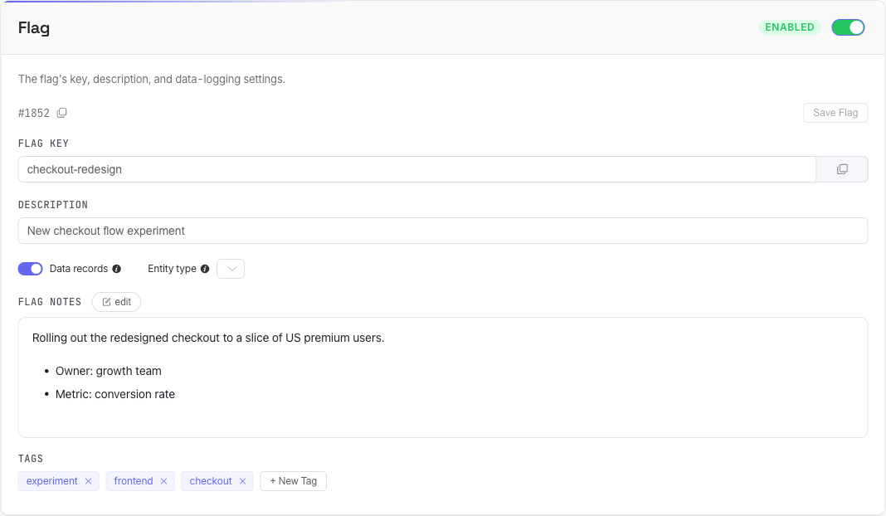

# Editing a Flag

Opening a flag takes you to its editor. This page covers the layout, how saving works, and the flag's own settings (key, description, on/off, notes, tags, delete). Variants, segments, distributions, testing, and history each have their own guide.

## Layout

- **Breadcrumb** — `Flags / <key>` to get back to the list.
- **Sticky header** (stays visible as you scroll) shows the flag key, a status dot (green = enabled, red ring = disabled), an **Unsaved changes** badge when you have pending edits, and the **Save all changes** button.
- **Tabs** — **Config** (everything you edit), **Evaluation Flow** (a visual [tracer](flagr_ui_testing)), and **History** (the [change log](flagr_ui_testing)).
- **Section nav** — the pills (Flag · Variants · Segments · Debug · Settings) jump to each section and highlight where you are as you scroll.

## How saving works

Flagr **never saves automatically** — every change is explicit, so nothing reaches production by accident.

- Each block (the flag, each variant, each segment, each constraint) has its **own Save button**. It lights up (turns blue) only when that block has unsaved edits, and is greyed out otherwise.
- **Save all changes** in the sticky header saves *everything* that's pending in one click. It's resilient: invalid constraints are **skipped**, and if an individual save fails the rest still go through. The summary toast tells you which of three things happened — everything saved, some items were skipped (fix and retry), or some saves errored.
- The **Unsaved changes** badge appears whenever anything is dirty. If you try to leave the page — or close the tab — with unsaved edits, Flagr asks you to confirm first.
- Shortcut: <kbd>Cmd/Ctrl</kbd>+<kbd>S</kbd> triggers **Save all changes**.

!> Edits are only live after you save. A blue Save button (or the Unsaved changes badge) means there's something not yet persisted.

## Configuration warnings

If a segment is misconfigured in a way that silently breaks evaluation, a warning banner appears at the top of **Config** summarizing it, with a link that scrolls straight to the segment. The two cases it catches are a segment at **0% rollout** and a segment with **no distribution** — both mean matching entities get no variant. See [Segments & Targeting](flagr_ui_segments).

## The Flag card

### Key and ID

- The **flag ID** (`#42`) is shown with a copy button.
- The **Flag key** is editable and has its own copy button — this is the value your code passes as `flagKey` when [evaluating](flagr_eval_api). Changing it renames the flag everywhere.

After editing the key or description, click **Save Flag**.

### Description

A free-text description shown in the list and the breadcrumb. Purely for humans.

### Enabled / Disabled

The toggle in the card header turns the flag on or off. A **disabled flag returns no variant** to every caller — it's the master switch (and a fast kill switch). Toggling it saves immediately and shows a `Flag enabled` / `Flag disabled` toast.

### Data records

- **Data records** — when on, evaluations of this flag are logged to the metrics pipeline (Kafka/Kinesis/Pub-Sub or the built-in [Analytics](flagr_datar)). Off by default, configurable per flag.
- **Entity type** — an optional label (e.g. `user`, `device`) attached to those records. Its behavior depends on server config: by default it's a **free-text** field with autocomplete from entity types already in use (plus a `<null>` option); if the operator has set a fixed list (`FLAGR_UI_POSSIBLE_ENTITY_TYPES`), it becomes a **dropdown** limited to those values. Leaving it empty uses the entity type sent at eval time — but note a non-empty value here **overrides** what the caller sends.

### Flag notes

A Markdown editor for documenting the flag — rollout plan, owner, links. An **edit / view** toggle switches between writing and the rendered preview, a toolbar covers the common formatting, and a **?** button opens a Markdown cheat-sheet. A character counter and an *Edit / Preview* status sit below the field; the notes block is hidden entirely when notes are empty and you're not editing.

It renders full **GitHub-flavored Markdown** — including tables and task-list checkboxes (`- [ ]` / `- [x]`) — plus **KaTeX math**: inline `$…$` and block `$$…$$`.

Keyboard shortcuts while editing:

| Shortcut | Action |
|---|---|
| <kbd>Ctrl</kbd>+<kbd>B</kbd> / <kbd>Ctrl</kbd>+<kbd>I</kbd> | Bold / italic |
| <kbd>Ctrl</kbd>+<kbd>Shift</kbd>+<kbd>S</kbd> | Strikethrough |
| <kbd>Ctrl</kbd>+<kbd>E</kbd> / <kbd>Ctrl</kbd>+<kbd>Shift</kbd>+<kbd>E</kbd> | Inline code / code block |
| <kbd>Ctrl</kbd>+<kbd>1</kbd> / <kbd>2</kbd> / <kbd>3</kbd> | Heading level 1 / 2 / 3 |
| <kbd>Ctrl</kbd>+<kbd>K</kbd> | Insert link |

### Tags

Add tags to group and find flags. Type a name and press <kbd>Enter</kbd> (autocomplete suggests existing tags); click the **×** on a chip to remove one. Tag values follow the same rules as variant keys — up to 63 characters, letters/digits/`-`/`/`/`.`/`:` — and an invalid value is rejected. Tags power [search](flagr_ui_flags) and tag-based [evaluation](flagr_eval_api).

## Deleting a flag

In the **Settings** section, **Delete Flag** opens a confirmation that asks you to **type the flag key** to confirm — a guard against accidental deletion. Deletion is a *soft delete*: the flag is hidden and can be brought back from **Deleted Flags** on the list page (see [Managing Flags](flagr_ui_flags)).
