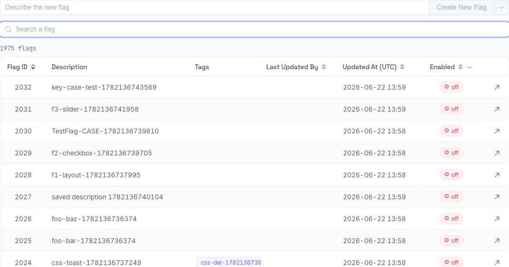

# Managing Flags

The flags list is the home screen. From here you create flags, find existing ones, and recover deleted ones.

## Create a flag

At the top of the list, type a short description in **Describe the new flag**, then use the green button:

- **Create New Flag** — creates an empty flag with just your description. You add variants and segments yourself on the next screen.
- **Create Simple Boolean Flag** (in the button's dropdown) — creates a ready-to-use on/off flag: it comes with `on` / `off` variants and a segment already wired up, so you can toggle it immediately.

The button is disabled until you've typed a description. After creating, Flagr opens the new flag's page and shows a **Flag created** toast.

!> A new flag is **disabled** by default and returns no variant until you enable it. Set it up first, then flip it on. See [How Evaluation Works](flagr_evaluation).

## Find a flag

The **search** box filters the list as you type (results update after a short pause).

- Press <kbd>/</kbd> anywhere on the page to jump to the search box.
- It matches the flag **ID**, **key**, **description**, and **tags** — all case-insensitive.
- Separate terms with a **comma** to require *all* of them. `checkout, beta` matches flags that contain both "checkout" *and* "beta".
- Use the **×** to clear the search.

The counter under the box shows how many flags match (`12 flags`), and `of 200 total` while a search is active. If nothing matches you'll see **No flags match your search**; an empty instance shows **No feature flags yet**.

## The table

| Column | Notes |
|--------|-------|
| **Flag ID** | Numeric ID. Click the header to sort (newest first by default). |
| **Description** | Free-text description. |
| **Tags** | Tag chips, if any. |
| **Last Updated By** | Who last changed the flag. Sortable. |
| **Updated At (UTC)** | Last change time in UTC. Hover for a relative time ("3 hours ago"). Sortable. |
| **Enabled** | An `on` / `off` status pill. Use the column filter to show only enabled or disabled flags. |
| **Action** | The ↗ icon opens the flag in a new tab. |

- **Click a row** to open that flag.
- **Cmd/Ctrl-click a row** (or click the ↗ icon) to open it in a new browser tab.
- On narrow screens the secondary columns (Tags, Last Updated By, Updated At) are hidden so the ID, description, and status stay readable.

If there are more than 50 flags, page controls appear at the bottom.

## Deleted flags & restore

Deleting a flag is a **soft delete** — it's hidden, not destroyed. At the bottom of the list, expand **Deleted Flags** (it loads on demand) to see them.

Click **Restore** on any row and confirm — the flag returns to the active list exactly as it was. See [Editing a flag → Deleting](flagr_ui_editor) for how deletion works.
