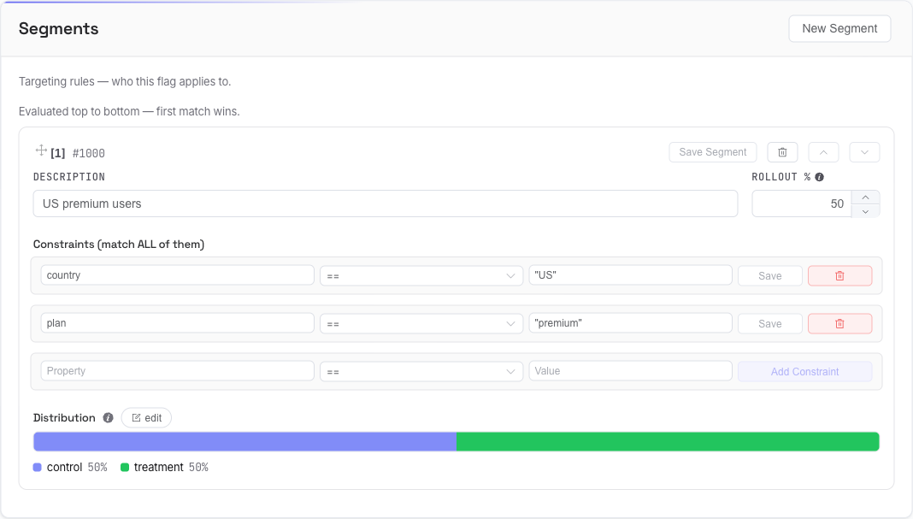

# Segments & Targeting

A **segment** is a targeting rule: *who* a flag applies to, and *how much* of them. A flag is evaluated against its segments top to bottom, and the **first matching segment wins**. Within a matched segment, the [distribution](flagr_ui_distribution) decides which variant the entity gets.

The Segments section is on the flag's **Config** tab.

## Create a segment

Click **New Segment**. In the dialog, give it a **description** and a **Rollout %** (it defaults to **50%**, not 0 — so a fresh segment includes half of matching entities until you change it), then **Create Segment**. It's added to the bottom of the list.

## Order matters — first match wins

Segments are evaluated in order, and evaluation stops at the first one that matches. Put your **most specific** segments first; a broad segment above a narrow one means the narrow one is never reached.

- The `[1]`, `[2]`, … badges show evaluation order.
- Drag the handle (⠿) to reorder, or use the **▲ / ▼** buttons.
- Reordering saves immediately (`Segment reordered`).
- The hint *"Evaluated top to bottom — first match wins"* sits above the list as a reminder.

## Segment fields

- **Description** — a human label.
- **Rollout %** — the share of *matching* entities actually included (0–100). Rollout is deterministic per entity, so a 20% rollout always includes the same 20%. It's a **gate**: in or out. See [rollout vs. distribution](flagr_ui_distribution).

Click **Save Segment** after editing. The trash icon deletes the segment (and its constraints and distributions) after a confirmation.

## Constraints

**Constraints** define *who* is in the segment. They're listed under **Constraints (match ALL of them)** — every constraint must match (`AND`). A segment with **no constraints matches everyone**.

Each constraint is three parts:

- **Property** — the key in the entity's context to check (e.g. `state`, `age`).
- **Operator** — how to compare (`==`, `IN`, `>=`, regex, …).
- **Value** — what to compare against.

Add one with the row at the bottom (**Add Constraint**); edit and **Save** or delete each existing one. The operator dropdown shows a short description of each operator.

!> Quote string values — `"CA"`, not `CA`. The editor shows an inline hint when a value looks wrong (an unquoted string, a non-number for `<`, a malformed list, a bad regex) and keeps **Save** disabled until it's fixed. Full reference: [Constraint Operators](flagr_operators).

## Warnings

Flagr flags two silent misconfigurations right on the segment (and in the summary at the top of Config):

- **Rollout is 0%** — the segment matches no one, so an experiment looks live but isn't.
- **No distribution set** — matched entities have no variant to receive.

Fixing the rollout or adding a [distribution](flagr_ui_distribution) clears the warning.

See also: [How Evaluation Works](flagr_evaluation) for the full match → rollout → variant path.
