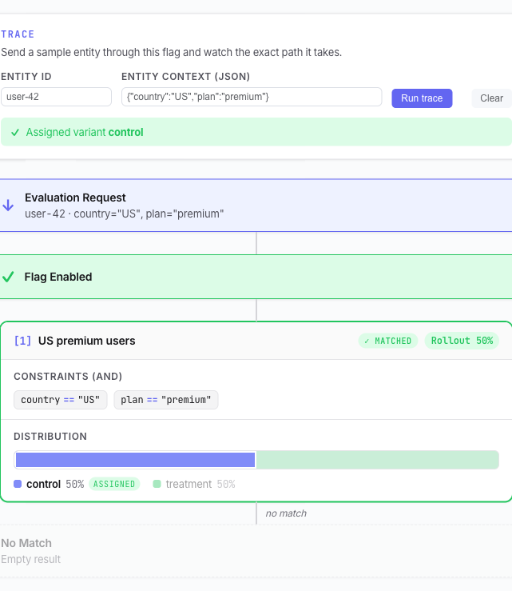
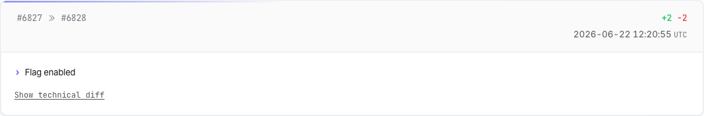

# Testing & History

Before (and after) you turn a flag on, you can check exactly how it behaves and review every change it's been through — all from the flag page, without touching live traffic.

## Debug Console

The **Debug Console** (in the **Config** tab) runs real evaluations against the flag and shows the raw result. It's **read-only** — it never affects production traffic or records data.

It has two sections:

- **Evaluation** — evaluate the flag for a single entity. The left pane is the request (`POST /api/v1/evaluation`), the right pane is the response. Edit the request JSON — `entityID`, `entityContext`, etc. — and click **POST /api/v1/evaluation**. The response shows the matched `variantKey`, `segmentID`, attachment, and a debug log.
- **Batch Evaluation** — the same idea for many entities at once (`POST /api/v1/evaluation/batch`).

Use it to answer *"what does this user get?"* with a concrete example. The request/response schema is documented in the [Evaluation API](flagr_eval_api) guide.

!> Quote string constraint values in the context the same way you do in constraints — see [Constraint Operators](flagr_operators).

## Evaluation Flow

The **Evaluation Flow** tab visualizes the whole [evaluation path](flagr_evaluation) and lets you trace a sample entity through it step by step.

1. Enter an **Entity ID** and an **Entity context (JSON)** — e.g. `{"country":"DE"}`.
2. Click **Run trace**.

Flagr then highlights the exact path the entity took:

- The **flag enabled** gate (green if on, red if off).
- Each **segment**, top to bottom, with a status pill:

| Status | Meaning |
|--------|---------|
| **✓ Matched** | Constraints matched and the entity is inside the rollout — this segment assigned the variant. |
| **Rollout excluded** | Constraints matched, but the entity fell outside the rollout %. |
| **✗ No match** | The constraints didn't match. |
| **Not reached** | An earlier segment already won, so this one was never evaluated. |
| **Eval error** | A constraint couldn't be evaluated (e.g. a malformed expression or context). The segment is treated as a non-match. |

- A terminal node showing the outcome, and an **outcome banner** at the top: which variant was assigned, or why there's none (excluded by rollout / no segment matched / flag disabled).

Click **Clear** to reset the trace. Like the Debug Console, this never affects live traffic.

## History

The **History** tab is the flag's audit log. Each entry is a **snapshot** taken when the flag changed, newest first, and shows:

- A plain-language **summary** of what changed (e.g. *"Rollout (beta): 10% → 50%"*, *"Added variant 'treatment'"*, *"Flag enabled"*).
- **Who** made the change and **when** (UTC, with a relative-time tooltip).
- A **Show technical diff** toggle that reveals the exact git-style JSON diff for that revision.

History loads when you open the tab. Use it to see who changed what, and to understand how a flag reached its current state.

> Looking to **recover a deleted flag**? That's on the flags list, not here — see [Managing Flags](flagr_ui_flags).
