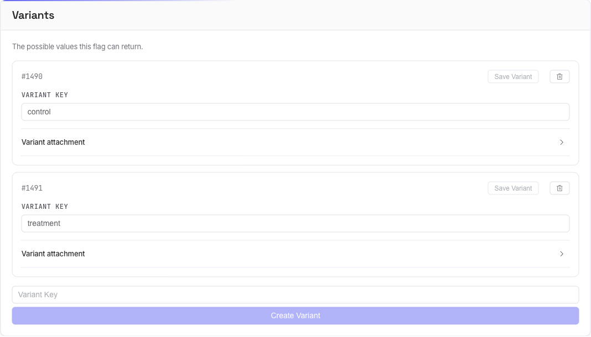

# Variants

**Variants** are the possible values a flag can return — `on`/`off`, `control`/`treatment`, `green`/`blue`/`pink`, and so on. Evaluation always returns one variant (or none); your code branches on the variant key.

The Variants section is on the flag's **Config** tab.



## Create a variant

Type a **Variant Key** in the input at the bottom of the section and click **Create Variant**. The key must be unique within the flag and may contain letters, numbers, hyphens, slashes, dots, and colons (up to 63 characters) — an inline message appears if it's invalid, and the button stays disabled until it's valid.

If a flag has no variants yet you'll see a **No variants defined yet** placeholder.

## Edit or delete a variant

Each variant shows its `#id` and an editable **Variant key**:

- Change the key and click **Save Variant** (enabled only when there are unsaved edits).
- The trash icon deletes the variant.

!> You can't delete a variant that a segment's [distribution](flagr_ui_distribution) still uses. Flagr blocks it and tells you to remove the segment or edit its distribution first — otherwise traffic would point at a variant that no longer exists.

## Variant attachment

Each variant can carry a **Variant attachment** — an arbitrary JSON object returned alongside the variant. This is how you ship [dynamic configuration](flagr_use_cases): colors, copy, limits, feature parameters.

Expand **Variant attachment** under a variant to open the JSON editor and add key/value pairs, for example:

```json
{ "color_hex": "#42b983", "layout": "modern" }
```

The attachment comes back in the evaluation response as `variantAttachment`. Invalid JSON is rejected on save, so you can't store a broken attachment.

!> Serving a typed value over [OpenFeature/OFREP](flagr_ofrep)? Put it under a `value` key (e.g. `{ "value": 42 }`) — OFREP resolves the flag's value from `attachment.value`.

Next: route traffic across these variants with [Distributions](flagr_ui_distribution).
